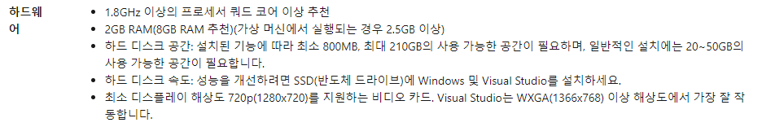

## 1. 통합개발환경(ide) 선택

### 1.1 python IDLE

일단 첫번째로, python을 설치할때 기본적으로 같이 동봉되는 IDLE이라는 선택지가 있습니다.

처음 시작할때는 이만한 선택지가 없죠. 따로 설치할 필요도 없고, 호환성이나 다른 복잡한 문제들을 **전혀** 신경쓸 필요가 없습니다.

하지만 그런 장점도 있다면 단점들도 있겠죠?

1. 폴더를 여는 기능이 없다. -> 여러 파일들을 다루는 프로젝트에는 적합하지 않다.
2. 자동완성이나 저장, git 등 편리한 부가기능들이 없다.

이러한 단점들이 있긴 하지만, 간단하게 파일을 열어볼 때는 나쁘지 않은 선택지 입니다.

### 1.2 sublime text 3

말하지 않아도 될만큼 유명한 편집기이죠, 하지만 무료 버전을 사용한다면 매번 이러한 팝업창이 뜰 겁니다.`you need to purchase a license for continued use`

하지만 별 문제는 없습니다. 그저 귀찮을 뿐..

### 1.3 atom

자! 나왔습니다. github에서 개발하여 여러 패키지들과 깔끔한 ui, 많은 확장들..

python만 다룰것이 아니라면 atom은 상당히 좋은 선택입니다.

앞서 말했듯이 github에서 개발하였기에, git의 사용도 간편하며 쉽습니다.

한가지 단점이자 장점이 있습니다. 바로 처음에는 정말 기본적인 에디터만 존재한다는 거죠.

어떤 사람들에게는 깔끔하여 장점이 될수도 있고, 어떤 사람에게는 기능이 없어 흥미가 가지않는 **그저그런** 에디터처럼 보일수도 있겠죠.

### 1.3 Pycharm

python을 위한, python을 위해, python으로!.. 사실 무료인 community 버전만 그렇습니다.

돈을 주고 구매할수 있는 professional 버전은 완전한 ide의 형태를 지니고 있으며 코드 자동완성, 디버깅, 잘못된 문자열 하이라이팅, git 등등... 사실 이중 대부분은 community버전에도 있는 기능입니다. 그러나 flask 등을 배우다 보면 약간의 아쉬움을 느낄지도 모릅니다.

단점이 하나 있는데, 컴퓨터 자원을 아낌없이 먹는다는 겁니다. 4g 이하의 ram 정도라면(실제 노트북 기준)windows 7환경에서 약간의 **버벅거림** 이 느껴집니다. 물론 그 창만 띄워 놓는다면 상관 없을지도 모르지만 보통 인터넷 정도는 띄워 두고 작업을 하니 말이죠.

### 1.4 **VISUAL STUDIO CODE**

본론 나왔습니다! 본가 격인 visual studio에서 텍스트 편집 부분만 **똑** 떼어내 만든(+디버거,터미널) 아주 가벼운 에디터이죠.

여기 보다시피 무려 20~50GB가 필요하다고 나와있습니다. 하지만 vscode는 겨우 100~200MB 정도만 필요하죠. 그래서 portable 버전도 있습니다.(여기서 다루지는 않습니다.)

본인이 아주 잘 쓰고있는 에디터중 하나이며 넓은 확장 생태계를 자랑합니다.

거기다 .MD 즉 markdown역시 지원하고 미리보기도 지원합니다.

바로바로 변경 즉시 미리보기에 반영되어 글을 작성하기에도 용이하죠.

물론 지금 글 작성은 typora로 하고있긴 하지만...(나중에 따로 다룰 예정입니다)

아까 말했듯이 기본적으로는 오직 텍스트 에디터이므로, python에서 활용하려면

확장들을 설치해야 합니다. 또한 내장된 git기능 역시 존재하죠. 유용한 디버거, 내장된 터미널 트리형 파일 시스템... 확장으로 소소하게는 시계를 추가하는 것부터

파이썬의 `jupyter`역시 확장으로 설치할수 있습니다.

정말 가볍고, 다루기 쉬우며 간단합니다. 또 확장으로 더욱 편리하게 사용할수 있죠.

## 2. 에디터를 고른 후에는?

어려울것 없습니다! 즐기세요!

...

...

사실 그냥 쓰라고 하면 적응하기 힘들죠. 나중에 적응하는 법도 포스팅할 예정입니다. 일단 편하게 써보세요.
